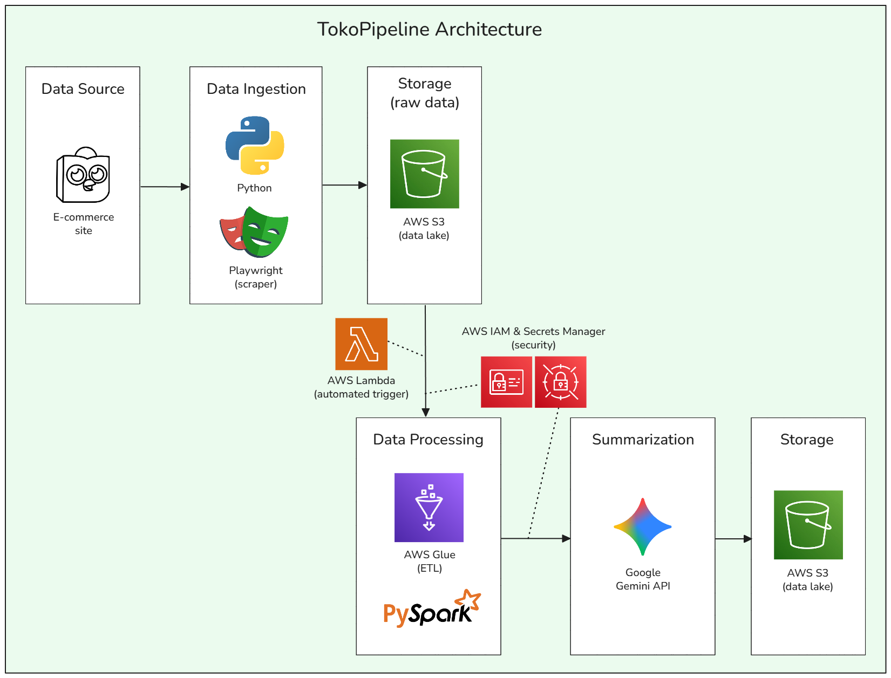

# TokoPipeline



TokoPipeline is an e-commerce review summary pipeline built on Amazon Web Services (AWS). This pipeline ingests raw product reviews from a popular (green) Indonesian e-commerce website, processes the data in a serverless environment, and uses a generative AI model (Google Gemini) to produce a concise summary of a product's pros and cons based on real user reviews.

> [Check out the demo video here!](https://youtu.be/IvpCCmheR0M)

This project was built as my final project for CS50x: Introduction to Computer Science. I took CS50x in late 2024 and finished this final project in 2025. The ten weeks worth of lectures, problems, and projects have given me a strong foundation in programming and computer science. Using that knowledge, I set out to solve a problem that I (and many friends) faced frequently: wasting a lot of time reading reviews on e-commerce sites. I thought it would be convenient to get concise summaries of the pros and cons of the product based on other users' reviews without having to read them. Hence, the result was TokoPipeline. 

I chose this data pipeline idea because I'm also interested in learning about data engineering, machine learning, and the relevant tools in the field. Building this pipeline required learning and integrating a suite of powerful cloud and data processing technologies, including AWS Glue for serverless Spark jobs, AWS Lambda for event-driven orchestration, AWS S3 as a data lake, Playwright for web scraping, and the Google Gemini API for generative AI summarization. 

**Tech Stack:** Python, Playwright, AWS S3, AWS Lambda, AWS Glue (PySpark), AWS Secrets Manager, AWS IAM, Google Gemini API.

---

## Key Features

### Automated Data Ingestion & Processing

-   **Dynamic Web Scraping →** A Python scraper built with Playwright navigates an e-commerce product review page, automatically handling dynamic content, pagination, and modal pop-ups to extract raw product review data.
-   **Intelligent Text Extraction →** The scraper identifies and expands truncated review text by programmatically clicking "Show More" (Selengkapnya) buttons.
-   **Structured Data Output →** Raw review data is structured and saved in JSON, named dynamically based on the product extracted from the URL.

### AI-Powered Review Summarization

```
"summary": {
        "pros": [
            "Here's a summary of the main Pros based on the keywords provided:",
            "",
            "   Positive Product Experience: Customers are happy with the product quality, scent (wanginya enak, aroma wangi), and performance (performa bagus, mantap). Many find the products invigorating and refreshing, leaving them feeling good (badan seger).",
            "   Good Value for Money: The price is considered good (harga bagus) for the quality received.",
            "   Excellent Seller Service: The seller is praised for being responsive (respons cepat), friendly (ramah), and providing good service (pelayanannya bagus).",
            "   Secure and Fast Packaging/Delivery: Customers appreciate the secure and protective packaging (packing tebal, bubble wrap, kemasannya baik) which ensures items arrive undamaged. Delivery is also noted as fast (pengiriman cepat).",
            "   Accurate Product Description: The product matches the description (sesuai deskripsi)."
        ],
        "cons": [
            "Here's a summary of the cons based on the keywords provided:",
            "",
            "   Some customers received products that appeared old or used, with issues like unusual smells or damaged packaging.",
            "   There were concerns about expired products or misleading expiration dates, with some sellers allegedly altering or removing them.",
            "   Customers experienced long waiting times for shipping and slow or unhelpful responses from sellers.",
            "   Some buyers felt deceived, describing sellers as untrustworthy or even fraudulent.",
            "   Product packaging was often described as flimsy, leading to items arriving damaged or in poor condition."
        ]
    }
```

-   **Automated Sentiment Analysis →** A PySpark job running in AWS Glue automatically categorizes reviews into "positive," "negative," and "neutral" sentiments based on their star rating.
-   **Feature Engineering for AI →** The pipeline performs word frequency analysis on the review text, filtering out common stop words to identify the most relevant and impactful keywords for each sentiment category.
-   **Generative AI Summaries →** These focused keywords are sent to the Google Gemini API, which generates a concise, user-friendly, bulleted list of product "Pros" and "Cons," transforming the reviews into actionable insights.

### Event-Driven Cloud Architecture

-   **Serverless ETL Pipeline →** The entire transformation and summarization process is orchestrated in the cloud. An upload to an S3 bucket automatically triggers an AWS Lambda function, which then initiates the AWS Glue ETL job.
-   **Secure Cloud Operations →** All cloud credentials, including the Gemini API key, are securely managed using AWS Secrets Manager and accessed via a precisely scoped IAM Role, following industry best practices for security.
-   **Optimized Data Storage →** The final AI-generated summaries are stored back in AWS S3 as structured JSON files.

---

## Technical Highlights

-   **Event-Driven Architecture with AWS Lambda →** The pipeline is fully automated using an event-driven design. An S3 `ObjectCreated` event triggers a Python-based AWS Lambda function, which acts as a lightweight orchestrator to start the main ETL job.
-   **Serverless Big Data Processing with AWS Glue & PySpark →** The core ETL logic is executed in a serverless Apache Spark environment managed by AWS Glue. This allows for distributed, parallel processing of review data without managing any server infrastructure.
-   **Automated Web Scraping with Playwright →** A sophisticated Python script uses Playwright to control a headless browser, reliably navigating complex, dynamic web pages and extracting unstructured data.
-   **Scalable Cloud Storage with AWS S3 →** Amazon S3 is used as the central data lake, storing raw ingested data, intermediate files, and the final AI-generated summaries, providing a durable and scalable storage solution.
-   **Secure Credential Management with AWS Secrets Manager & IAM →** The project adheres to security best practices by storing the sensitive Gemini API key in AWS Secrets Manager and providing the Glue job with secure, read-only access via a tightly-scoped IAM Role.
-   **Generative AI Integration →** The pipeline enriches the data by calling the Google Gemini API to perform advanced NLP summarization, demonstrating the ability to integrate modern Machine Learning services into a data workflow.
